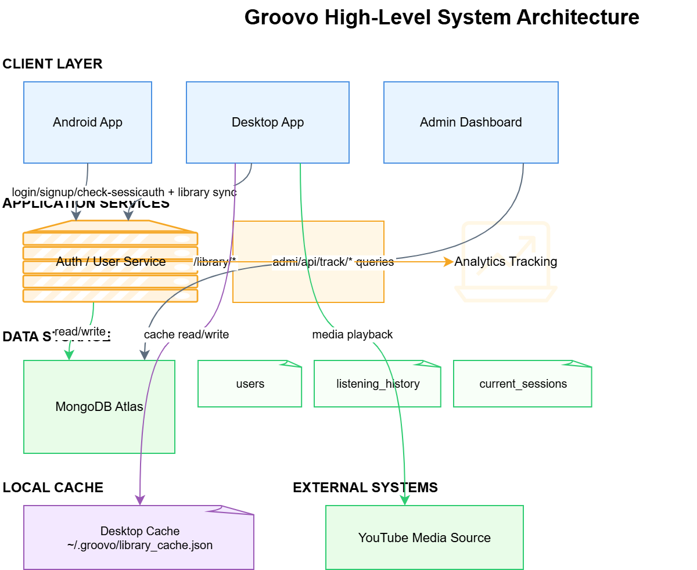
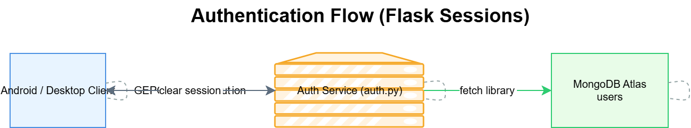
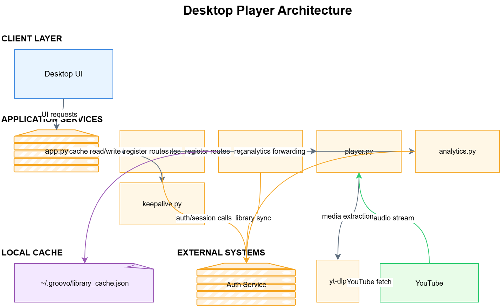
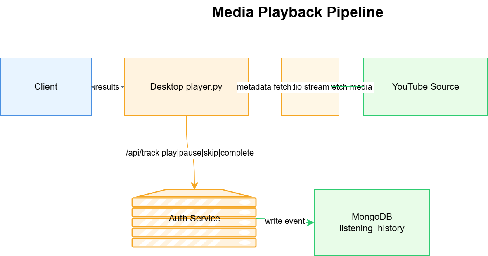
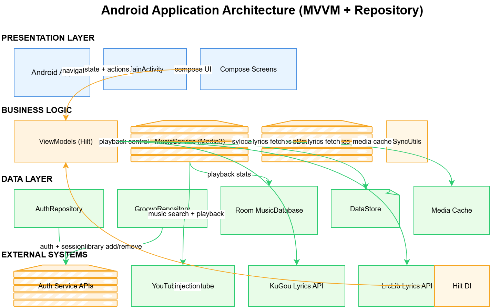
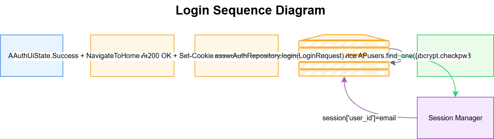
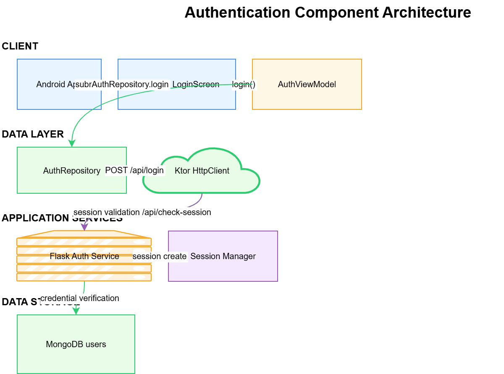
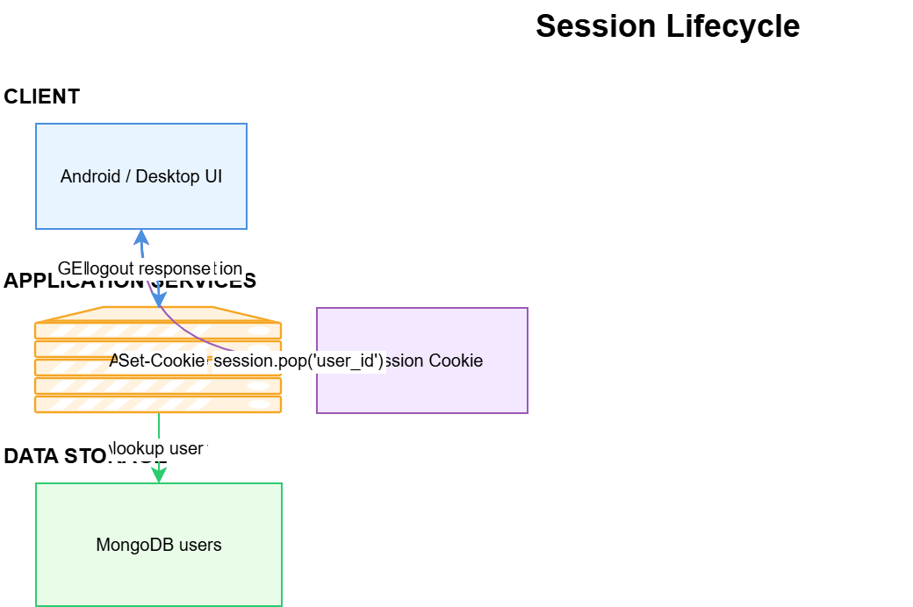

# Groovo System Design

This document captures the current architecture based strictly on the repository implementation. It includes the Android, Desktop, Admin, and Authentication flows, plus data storage and media playback pipelines.

## High-Level System Architecture

- Clients: Android app, Desktop app, Admin dashboard.
- Backend services: Flask auth service, library operations, analytics tracking.
- Data: MongoDB Atlas for users and analytics.
- External: YouTube media source (via yt-dlp on desktop, Innertube on Android).
- Local cache: Desktop library cache JSON file.

- Draw.io source: 01_high_level.drawio

## Authentication Flow (Flask Sessions)

- Android: Compose LoginScreen -> AuthViewModel -> AuthRepository -> AuthService (Ktor) -> Flask auth service.
- Desktop: HTML login form -> local Flask -> auth service.
- Backend: user lookup in MongoDB, bcrypt password check, Flask session cookie set.
- Session validation via /api/check-session. Logout clears the session.

- Draw.io source: 02_auth_flow.drawio

## Desktop Player Architecture

- Local Flask modules: app.py, auth.py, library.py, player.py, analytics.py, keepalive.py.
- Library cache in ~/.groovo/library_cache.json.
- yt-dlp extracts media and streams from YouTube.
- Analytics events forwarded to auth service.

- Draw.io source: 03_desktop_player.drawio

## Media Playback Pipeline

- Client triggers /play and /search on desktop player.py.
- yt-dlp extracts audio and metadata from YouTube.
- Analytics events are sent to /api/track/* and stored in MongoDB listening_history.

- Draw.io source: 04_media_playback.drawio

## Android Application Architecture (MVVM + Repository)

- Presentation: MainActivity + Compose screens.
- Business logic: Hilt ViewModels, MusicService, ExoDownloadService, SyncUtils.
- Data: AuthRepository, GroovoRepository, Room MusicDatabase, DataStore.
- External: Auth service APIs, YouTube Innertube, KuGou, LrcLib.

- Draw.io source: 05_android_architecture.drawio

## Login Low-Level Design (LLD)

- UI triggers AuthViewModel.login(email, password).
- AuthRepository builds LoginRequest and calls POST /api/login.
- Auth service looks up users collection by email and validates bcrypt password.
- Flask session cookie is set on success and returned to the client.
- Clients use /api/check-session for validation and /api/logout to clear the session.

- Draw.io source: 06_login_sequence.drawio

- Draw.io source: 07_auth_components.drawio

- Draw.io source: 08_session_lifecycle.drawio

## Diagram Index

- 01_high_level.drawio / 01_high_level.png
- 02_auth_flow.drawio / 02_auth_flow.png
- 03_desktop_player.drawio / 03_desktop_player.png
- 04_media_playback.drawio / 04_media_playback.png
- 05_android_architecture.drawio / 05_android_architecture.png
- 06_login_sequence.drawio / 06_login_sequence.png
- 07_auth_components.drawio / 07_auth_components.png
- 08_session_lifecycle.drawio / 08_session_lifecycle.png
